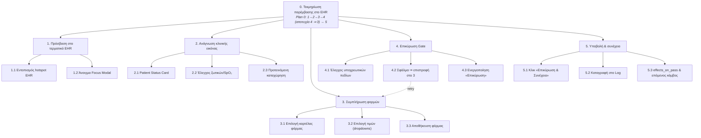

# Ιεραρχική Ανάλυση Εργασιών (HTA) — Ζητούμενο Β

**Λειτουργία υπό ανάλυση:** «Τεκμηρίωση παρέμβασης στο Ηλεκτρονικό Αρχείο Ασθενούς (EHR)»
**Πλαίσιο:** Διαδραστική Κλινική Προσομοίωση σε περιβάλλον ΜΕΘ (Ζητούμενο Α).
**Μέθοδος:** Hierarchical Task Analysis (HTA) — αποσύνθεση του στόχου σε υπο-εργασίες με σαφή *Plans* (κανόνες σειράς/επιλογής/επανάληψης).

---

## 1. Στόχος (Goal 0)

> **0. Τεκμηρίωση παρέμβασης στο EHR** ώστε να ξεκλειδώσει το Documentation Gate και να συνεχίσει η ροή του σεναρίου.

**Plan 0:** Εκτέλεσε **1 → 2 → 3 → 4**. Αν στο **4** η επικύρωση αποτύχει (ελλιπή πεδία), επίστρεψε στο **3**. Μόλις περάσει η επικύρωση, εκτέλεσε **5**.

---

## 2. Ιεραρχική αποσύνθεση

```
0. Τεκμηρίωση παρέμβασης στο EHR
│
├── 1. Πρόσβαση στο τερματικό EHR
│     1.1 Εντοπισμός του hotspot «Τερματικό EHR» στη σκηνή (διακριτικό glow/ένδειξη)
│     1.2 Κλικ στο hotspot → άνοιγμα Focus Modal (η σκηνή θολώνει)
│
├── 2. Ανάγνωση τρέχουσας κλινικής εικόνας  (Recognition rather than Recall)
│     2.1 Μελέτη του «Patient Status Card» (δυναμικό μήνυμα κατάστασης)
│     2.2 Έλεγχος ζωτικών (ένδειξη SpO₂ / χρωματικός κώδικας)
│     2.3 Σημείωση της «Προτεινόμενης καταχώρησης» (Δέρμα / Συνείδηση / Εύρημα)
│
├── 3. Συμπλήρωση φορμών τεκμηρίωσης
│     3.1 Επιλογή καρτέλας φόρμας (Κλινική Αξιολόγηση / Παρεμβάσεις / Επικοινωνία)
│     3.2 Επιλογή τιμής σε κάθε υποχρεωτικό dropdown
│            (π.χ. observation, skin_color, fiO2_setting, recipient, outcome)
│     3.3 (Προαιρετικά) Αποθήκευση φόρμας → καταγραφή EHR_SUBMIT
│
├── 4. Επικύρωση Documentation Gate
│     4.1 Έλεγχος πληρότητας υποχρεωτικών πεδίων (από το σύστημα)
│     4.2 [Αν ΕΛΛΙΠΗ] εμφάνιση toast σφάλματος + κόκκινη επισήμανση → επιστροφή στο 3
│     4.3 [Αν ΠΛΗΡΗ] ενεργοποίηση κουμπιού «Επικύρωση & Συνέχεια»
│
└── 5. Υποβολή & συνέχεια ροής
      5.1 Κλικ «✓ Επικύρωση & Συνέχεια»
      5.2 Καταγραφή EHR_SUBMIT / GATE_PASSED στο Action Log
      5.3 Εφαρμογή effects_on_pass (score_delta, flags) & μετάβαση στον επόμενο κόμβο
```

---

## 3. Plans (κανόνες εκτέλεσης)

| Plan | Τύπος | Περιγραφή |
|------|-------|-----------|
| **Plan 0** | Sequence + έλεγχος | 1 → 2 → 3 → 4· αν 4 αποτύχει ⇒ πίσω στο 3· μετά 5. |
| **Plan 1** | Sequence | 1.1 → 1.2 |
| **Plan 2** | Free order | Τα 2.1–2.3 με οποιαδήποτε σειρά (μόνο ανάγνωση). |
| **Plan 3** | Iteration | Επανάληψε 3.1 → 3.2 (→ 3.3) για **κάθε** απαιτούμενη φόρμα του gate. |
| **Plan 4** | Selection | Αν 4.1 = false ⇒ 4.2· αλλιώς ⇒ 4.3. |
| **Plan 5** | Sequence | 5.1 → 5.2 → 5.3 |

---

## 4. Διάγραμμα HTA (Mermaid)

> Το παρακάτω διάγραμμα αποδίδεται αυτόματα σε GitHub / VS Code (Mermaid).



---

## 5. Σύνδεση με αρχές HCI

- **Recognition rather than Recall** — το βήμα **2** (Patient Status Card + προτεινόμενες τιμές) ελαχιστοποιεί το μνημονικό φορτίο.
- **Error Prevention** — το βήμα **4** μπλοκάρει τη ροή και επισημαίνει ελλιπή πεδία πριν την υποβολή.
- **Visibility of System Status / Feedback** — toasts, χρωματικοί κώδικες και καταγραφή ενεργειών (βήμα 5.2).
- **User Control & Freedom** — δυνατότητα κλεισίματος (Esc) και επανάληψης (Plan 4 → 3).
